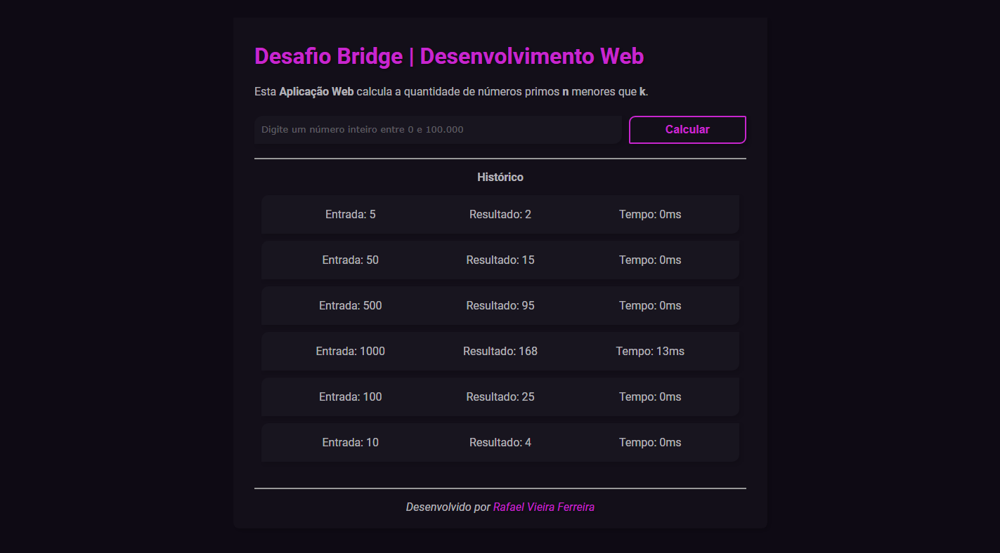

# 🔥 Desafio Bridge | Desenvolvimento Web 🔥

Esta **Aplicação Web** calcula a quantidade de números primos **n** menores que **k**.

## 📍 Índice

* [Sobre](#-sobre)
* [Tecnologias utilizadas](#-tecnologias-utilizadas)
* [Resultados](#-resultados)
* [Contato](#-contato)
* [Rodando localmente](#-rodando-o-projeto-localmente-)
    * [Pré-requisitos](#-pré-requisitos)
    * [Instalação](#-instalação)
    * [Iniciando os servidores](#%EF%B8%8F-iniciando-os-servidores)

## 📕 Sobre

O objetivo desse desafio (criado pelo [Laboratório Bridge](https://portal.bridge.ufsc.br)) é implementar uma Aplicação Web na qual, a partir de uma entrada, calcula a quantidade de números primos menores do que ela como saída (por exemplo, sendo a entrada 5, a saída do programa deve ser 2, pois 2 e 3 são primos). Além disso, o programa também conta o tempo levado para executar o cálculo, assim como exibe e armazena os resultados imediatamente na tela juntamente com o número informado pelo usuário.

## 🧪 Tecnologias utilizadas

Para a implementação do projeto as seguintes tecnologias foram utilizadas:

- **JavaScript e sua bibloteca ReactJS**, para o _frontend_ e funcionamento geral;
- **CSS e HTML**, para estilização e estruturação;
- **Java**, para o _backend_ e a realização dos cálculos;
- **Axios e Springboot**, responsáveis pela integração do _frontend_ e _backend_;
- **Npm**, para rodar o servidor _frontend_;
- **Git e Github**, para versionamento do projeto;
- **VS Code**, editor escolhido para trabalhar com o código e organizar as pastas.

## 💫 Resultados

Você pode ver abaixo uma demonstração do site em funcionamento:


## 🪐 Contato

Rafael Vieira Ferreira - <rafaelviefe@gmail.com>


# 🚀 Rodando o projeto localmente 🚀

Caso você queira rodar a Aplicação na sua própria máquina, aqui vai um passo a passo.

## 📜 Pré-requisitos

Antes de tudo verifique se você tem todas essas ferramentas instaladas e configuradas: [Java](https://www.java.com/pt_BR/), [NPM](https://www.npmjs.com/) e [VSCode](https://code.visualstudio.com/) (lembrando que você pode utilizar a IDE de sua preferência, a maioria delas possuem já extensões para Maven e JDK).

## 🌱 Instalação

* Primeiramente, você pode baixar o [repositório](https://github.com/rafaelviefe/calculadora-de-primos) e extrair na sua pasta desejada, ou cloná-lo diretamente através deste comando:

```
git clone https://github.com/rafaelviefe/calculadora-de-primos.git
```

* Agora, basta abrir a pasta do _frontend_ e do _backend_ e você está preparado para começar.

## ✔️ Iniciando os servidores

* Para rodar o _frontend_, abra o terminal no diretório "**calculadora-de-primos-main/frontend**";
* Em seguida, execute os seguintes comandos (na ordem):

```
npm install
npm start
```

* Para rodar o _backend_, execute o programa abaixo (para encontrá-lo, siga esse caminho: calculadora-de-primos-main/backend/app-bridge/src/main/java/com/example/appbridge):

```
AppBridgeApplication.java
```

* Os servidores web rodarão nas portas **:3000** e **:8080**, respectivamente (acesse usando <http://localhost:3000>).