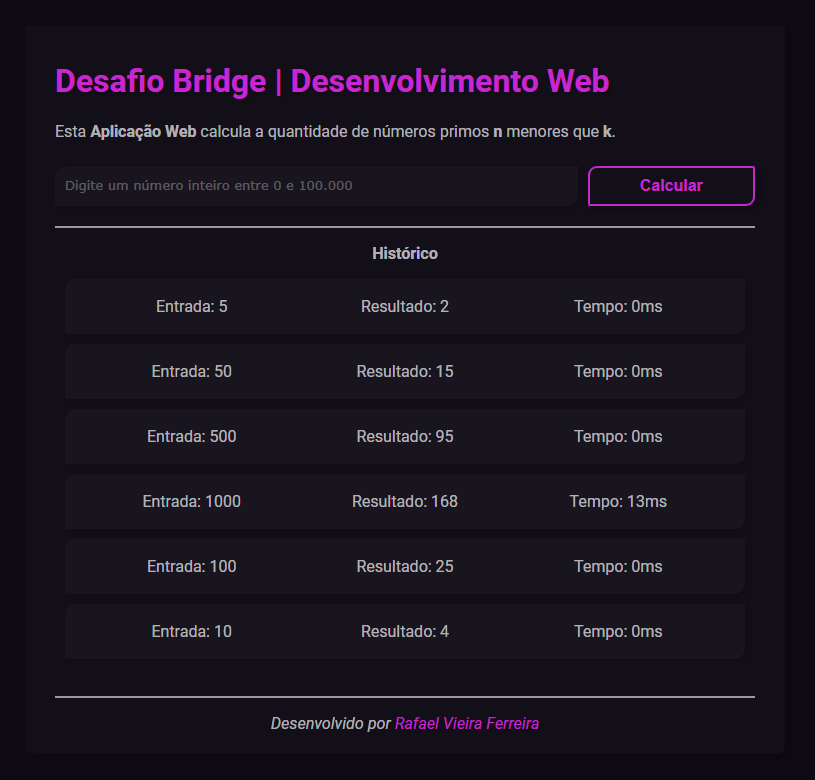

# 🔥 Desafio Bridge | Desenvolvimento Web

Esta Aplicação Web calcula a quantidade de números primos <strong>n</strong> menores que <strong>k</strong>.

## 📍 Índice

* [Sobre](#📕-sobre)
* [Tecnologias utilizadas](#🧪-tecnologias-utilizadas)
* [Resultados](#💫-resultados)
* [Rodando localmente](#♾️-rodando-localmente)

## 📕 Sobre

## 🧪 Tecnologias utilizadas

## 💫 Resultados

# 🚀 Rodando o projeto localmente

## 🌱 Pré-requisitos