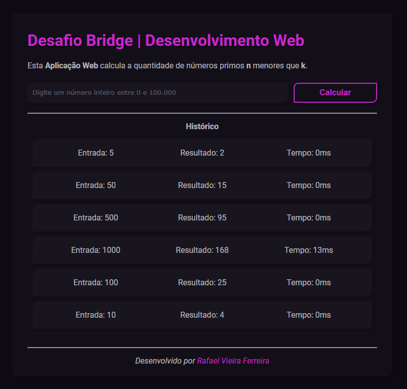

# 🔥 Desafio Bridge | Desenvolvimento Web 🔥

* Esta <strong>Aplicação Web</strong> calcula a quantidade de números primos <strong>n</strong> menores que <strong>k</strong>.

## 📍 Índice

* [Sobre](#-sobre)
* [Tecnologias utilizadas](#-tecnologias-utilizadas)
* [Resultados](#-resultados)
* [Rodando localmente](#-rodando-o-projeto-localmente-)

## 📕 Sobre

O objetivo (criado pelo [Laboratório Bridge](https://portal.bridge.ufsc.br)) desse desafio é implementar uma Aplicação Web na qual, a partir de uma entrada, calcula a quantidade de números primos menores do que ela como saída (por exemplo, sendo a entrada 5, a saída do programa deve ser 2, pois 2 e 3 são primos). Além disso, o programa também conta o tempo levado para executar o cálculo, assim como exibe e armazena os resultados imediatamente na tela juntamente com o número informado pelo usuário.

## 🧪 Tecnologias utilizadas

Para a implementação do projeto as seguintes tecnologias foram utilizadas:
- <strong>JavaScript e sua bibloteca ReactJS</strong>, para o frontend e funcionamento geral;
- <strong>CSS e HTML</strong>, para estilização e estruturação;
- <strong>Java</strong>, para o backend e a realização dos cálculos;
- <strong>Axios e Springboot</strong>, responsáveis pela integração do frontend e backend;
- <strong>Npm</strong>, para rodar o servidor frontend;
- <strong>VS Code</strong>, editor escolhido para trabalhar com o código.

## 💫 Resultados

# 🚀 Rodando o projeto localmente 🚀

## 🌱 Pré-requisitos